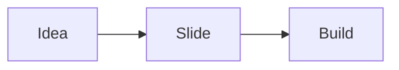

# Build-reveal animations

Mark any bullet, image, code block, table, or other element with `<!-- step -->` and it appears on its own click during a presentation — instead of the whole slide landing at once. <!-- step -->

Advance through this deck in **Presentation mode** (not the editor preview, which always shows everything so you can keep editing) to see each build happen. <!-- step -->

---

## Bullets, one at a time

```markdown
- Always visible from the start
- Appears on the first click <!-- step -->
- Appears on the second click <!-- step -->
- Appears on the third click <!-- step -->
```

- Always visible from the start
- Appears on the first click <!-- step -->
- Appears on the second click <!-- step -->
- Appears on the third click <!-- step -->

No numbers to manage — `<!-- step -->` auto-increments in document order.

---

## Grouping two things onto one click

```markdown
- Revealed alone, first click <!-- step -->
- These two <!-- step: 2 -->
- arrive together <!-- step: 2 -->
- Back to auto-increment <!-- step -->
```

- Revealed alone, first click <!-- step -->
- These two <!-- step: 2 -->
- arrive together <!-- step: 2 -->
- Back to auto-increment <!-- step -->

An explicit `<!-- step: N -->` groups elements onto the same click. A later bare `<!-- step -->` picks up counting from there — this one lands on click 3, not 2.

---

## Nested bullets build too

- Parent point <!-- step -->
  - First detail <!-- step -->
  - Second detail <!-- step -->
- Second parent point <!-- step -->
  - Its own detail <!-- step -->

Sub-bullets share the same per-slide click sequence as their parents.

---

## An image on its own click

```markdown

<!-- step -->
```


<!-- step -->

For a block element with no inline text to trail the marker on, `<!-- step -->` goes on its own line directly underneath — the same "must directly follow" convention `!caption` already uses.

---

## A code block on its own click

Always visible — the setup:

```js
function greet(name) {
  return `Hello, ${name}!`;
}
```

Revealed on the next click — the payoff:

```js
console.log(greet('Kova'));
```
<!-- step -->

---

## A table on its own click

| Quarter | Revenue |
|---|---|
| Q1 | $120k |
| Q2 | $150k |
<!-- step -->

The whole table appears together — tables build as one unit, not row by row.

---

## A callout on its own click

Setting the scene first:

Kova ships eleven built-in themes, and you can drop your own YAML file in the themes folder.

> [!tip]
> Community themes are signed and SHA-256 verified before Kova ever caches one.
<!-- step -->

---

## A formula, then a diagram

$$
E = mc^2
$$
<!-- step -->


<!-- step -->

Two separate elements, two separate clicks — the equation first, the diagram second.

---

## Mixing always-visible content with a build

The heading above and this sentence are visible the moment the slide appears — only what follows is gated behind clicks.

- Supporting point one <!-- step -->
- Supporting point two <!-- step -->

Useful for "here's the topic, now let's build up the argument."

---

## A whole list revealed together

Contrast with the per-bullet slides above — put the marker after the *list*, not each item, and all of it arrives on one click:

- No <!-- step -->
- per-item <!-- step -->
- markers <!-- step -->
<!-- step: 9 -->

A marker directly after a whole list gates every item as a single unit — any per-item markers inside that same list are cleared automatically rather than fighting the whole-list gate. (This list was intentionally over-marked above to prove that; all three lines still arrive on the same click here.)

---

## Builds inside a two-column layout

Left column, always visible:

Kova auto-detects columns, or you can force one with `|||`.

|||

Right column, builds in:

- First <!-- step -->
- Second <!-- step -->
- Third <!-- step -->

---

## Misplaced markers are errors, not silent no-ops

Just a plain sentence with nothing to attach to.
<!-- step -->


<!-- step -->
<!-- step -->

A `<!-- step -->` with no eligible element directly above it — or a second one stacked on an element that already has one — reports a clear `#ERR`, the same way a misplaced `!caption` does, instead of quietly vanishing.

---

## What just happened

- `<!-- step -->` auto-increments; `<!-- step: N -->` groups elements onto one click
- Trails inline after a paragraph or list item, or sits on its own line after a block (image, code, table, math, Mermaid, blockquote, or a whole list)
- Works in **Presentation mode**, the **presenter view**'s next-slide preview, the **audience window**, and the standalone **HTML export**
- Exports to real click-triggered animations in **PowerPoint** too
- A slide with no `<!-- step -->` markers at all behaves exactly as before — this is entirely opt-in
