# Pele renderer test deck

One slide per Mermaid diagram type, then the edge cases that have caught Kova out before. Flip Settings → Workspace → Diagram renderer between Mermaid and Pele and compare.

---

## Flowchart

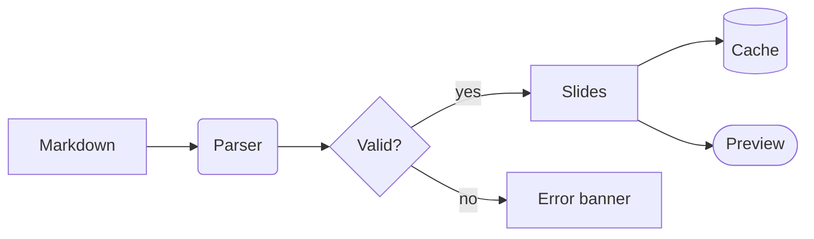
```mermaid
flowchart LR
    A[Markdown] --> B(Parser)
    B --> C{Valid?}
    C -->|yes| D[Slides]
    C -->|no| E[Error banner]
    D --> F[(Cache)]
    D --> G([Preview])
```

---

## Flowchart with subgraphs

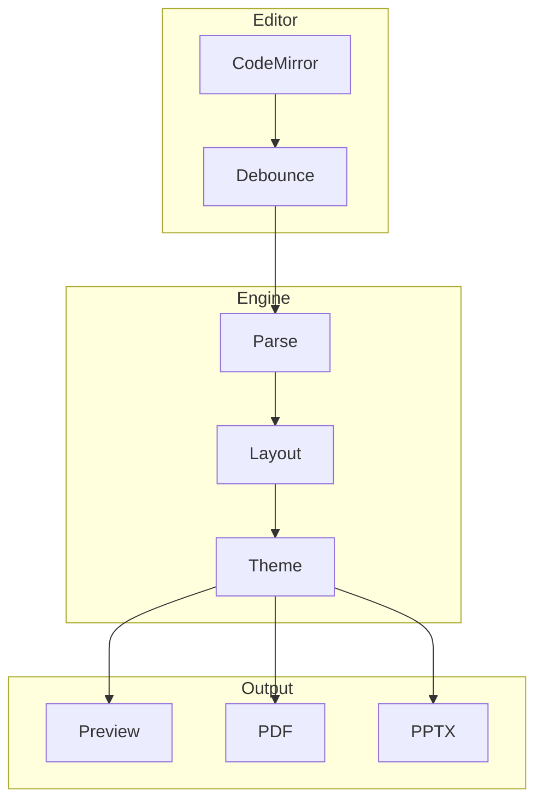
```mermaid
flowchart TB
    subgraph Editor
        E1[CodeMirror] --> E2[Debounce]
    end
    subgraph Engine
        P1[Parse] --> P2[Layout] --> P3[Theme]
    end
    subgraph Output
        O1[Preview]
        O2[PDF]
        O3[PPTX]
    end
    E2 --> P1
    P3 --> O1 & O2 & O3
```

---

## Sequence diagram

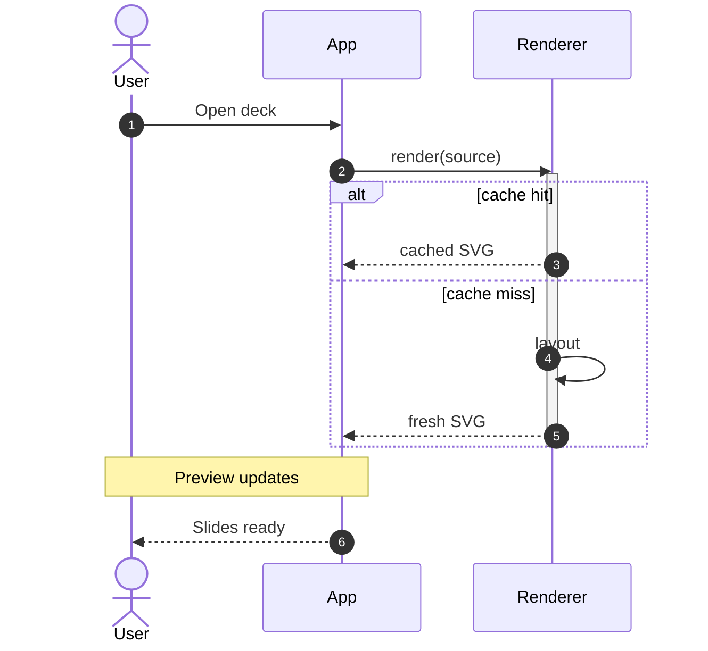
```mermaid
sequenceDiagram
    autonumber
    actor U as User
    participant A as App
    participant R as Renderer
    U->>A: Open deck
    A->>R: render(source)
    activate R
    alt cache hit
        R-->>A: cached SVG
    else cache miss
        R->>R: layout
        R-->>A: fresh SVG
    end
    deactivate R
    Note over U,A: Preview updates
    A-->>U: Slides ready
```

---

## Class diagram

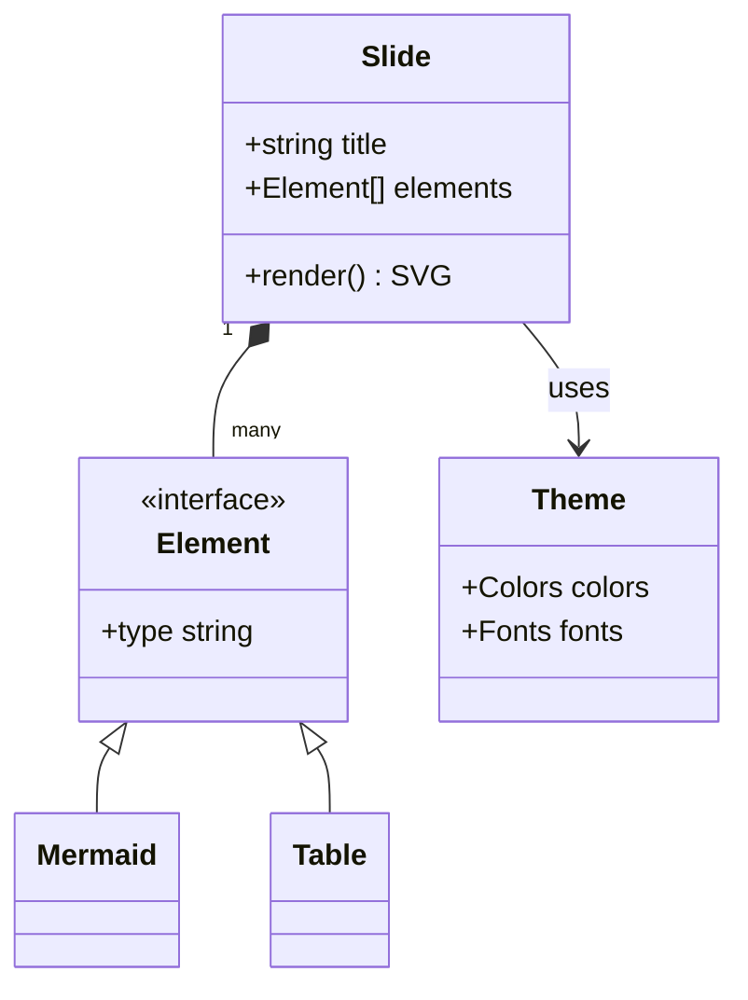
```mermaid
classDiagram
    class Slide {
        +string title
        +Element[] elements
        +render() SVG
    }
    class Element {
        <<interface>>
        +type string
    }
    class Theme {
        +Colors colors
        +Fonts fonts
    }
    Slide "1" *-- "many" Element
    Slide --> Theme : uses
    Element <|-- Mermaid
    Element <|-- Table
```

---

## State diagram

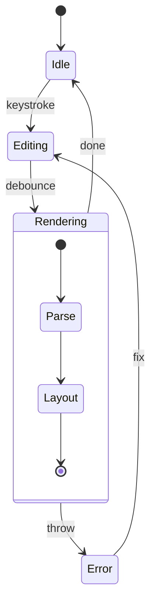
```mermaid
stateDiagram-v2
    [*] --> Idle
    Idle --> Editing : keystroke
    Editing --> Rendering : debounce
    Rendering --> Idle : done
    Rendering --> Error : throw
    Error --> Editing : fix
    state Rendering {
        [*] --> Parse
        Parse --> Layout
        Layout --> [*]
    }
```

---

## Entity relationship

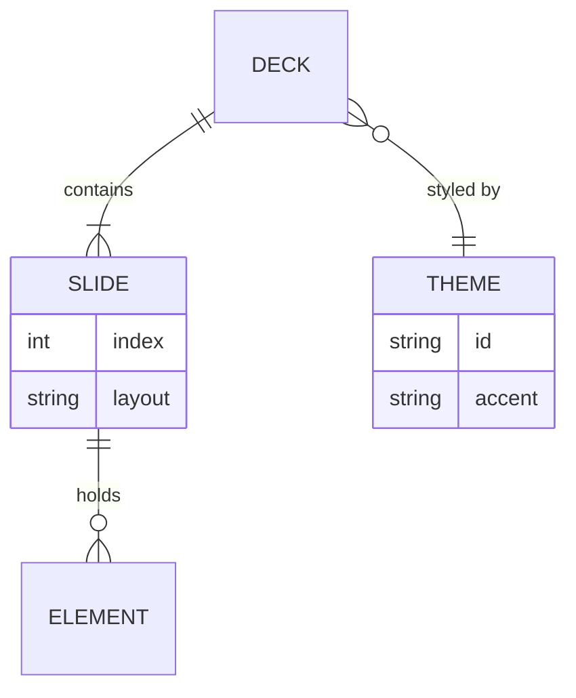
```mermaid
erDiagram
    DECK ||--|{ SLIDE : contains
    SLIDE ||--o{ ELEMENT : holds
    DECK }o--|| THEME : "styled by"
    SLIDE {
        int index
        string layout
    }
    THEME {
        string id
        string accent
    }
```

---

## Gantt

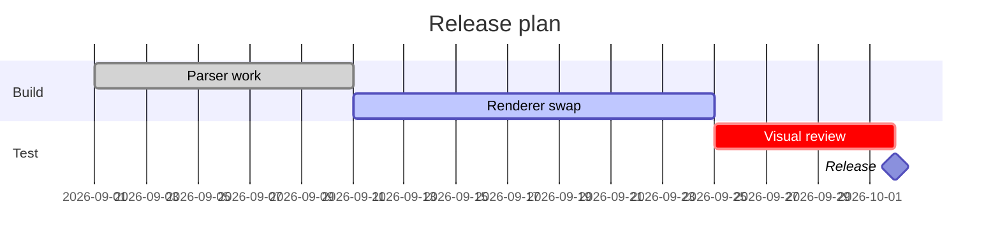
```mermaid
gantt
    title Release plan
    dateFormat YYYY-MM-DD
    section Build
    Parser work     :done, a1, 2026-09-01, 10d
    Renderer swap   :active, a2, after a1, 14d
    section Test
    Visual review   :crit, b1, after a2, 7d
    Release         :milestone, m1, after b1, 0d
```

---

## Gantt in the past (issue #195)

The "today" marker sits far off the right edge here. Neither engine should collapse the chart to a sliver.

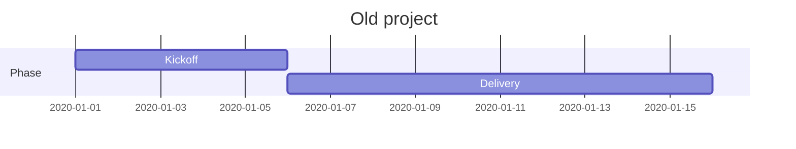
```mermaid
gantt
    title Old project
    dateFormat YYYY-MM-DD
    section Phase
    Kickoff  :2020-01-01, 5d
    Delivery :2020-01-06, 10d
```

---

## Pie

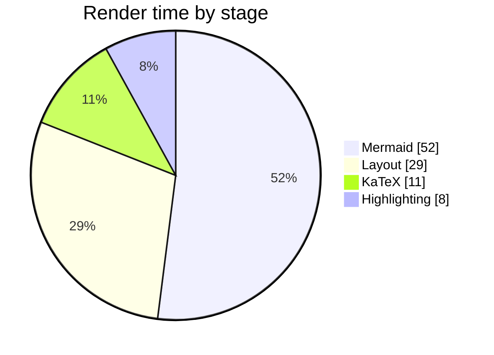
```mermaid
pie showData
    title Render time by stage
    "Mermaid" : 52
    "Layout" : 29
    "KaTeX" : 11
    "Highlighting" : 8
```

---

## Pie with many slices

Checks the palette wraps cleanly past eight colours.

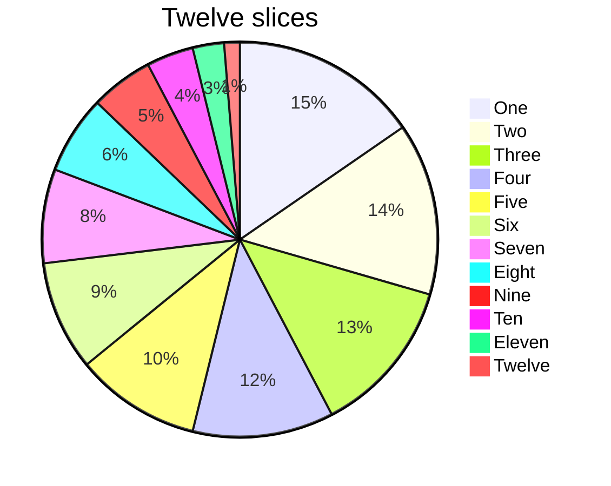
```mermaid
pie
    title Twelve slices
    "One" : 12
    "Two" : 11
    "Three" : 10
    "Four" : 9
    "Five" : 8
    "Six" : 7
    "Seven" : 6
    "Eight" : 5
    "Nine" : 4
    "Ten" : 3
    "Eleven" : 2
    "Twelve" : 1
```

---

## User journey

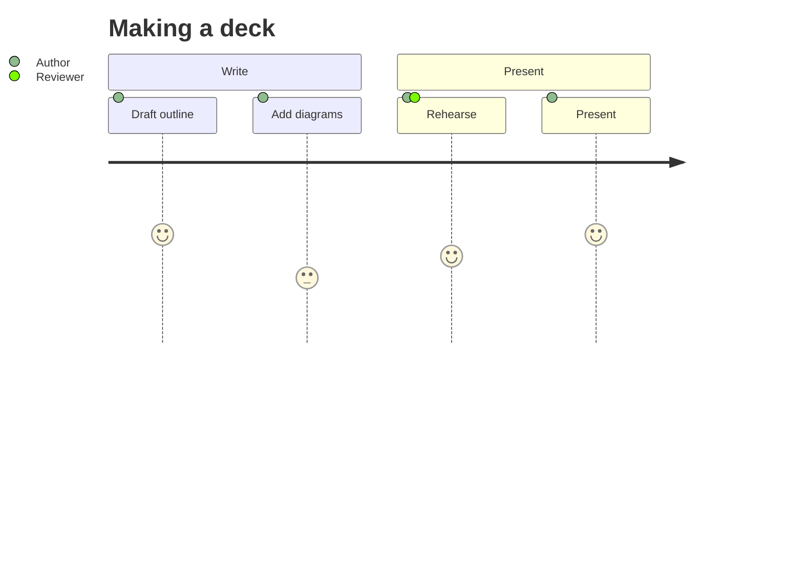
```mermaid
journey
    title Making a deck
    section Write
      Draft outline: 5: Author
      Add diagrams: 3: Author
    section Present
      Rehearse: 4: Author, Reviewer
      Present: 5: Author
```

---

## Mindmap

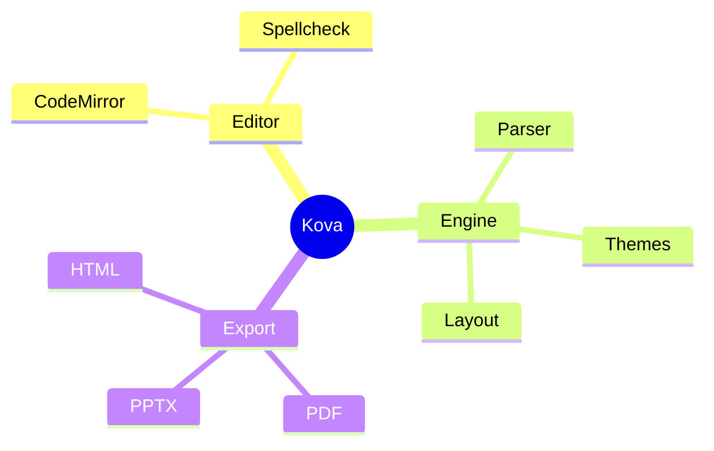
```mermaid
mindmap
  root((Kova))
    Editor
      CodeMirror
      Spellcheck
    Engine
      Parser
      Layout
      Themes
    Export
      PDF
      PPTX
      HTML
```

---

## Timeline

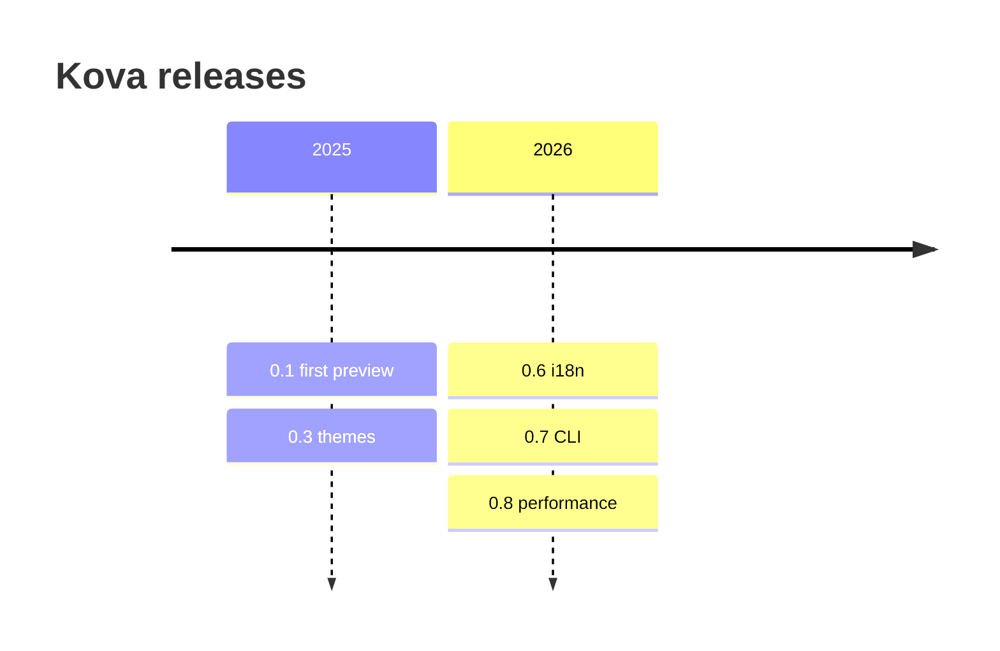
```mermaid
timeline
    title Kova releases
    2025 : 0.1 first preview
         : 0.3 themes
    2026 : 0.6 i18n
         : 0.7 CLI
         : 0.8 performance
```

---

## Git graph

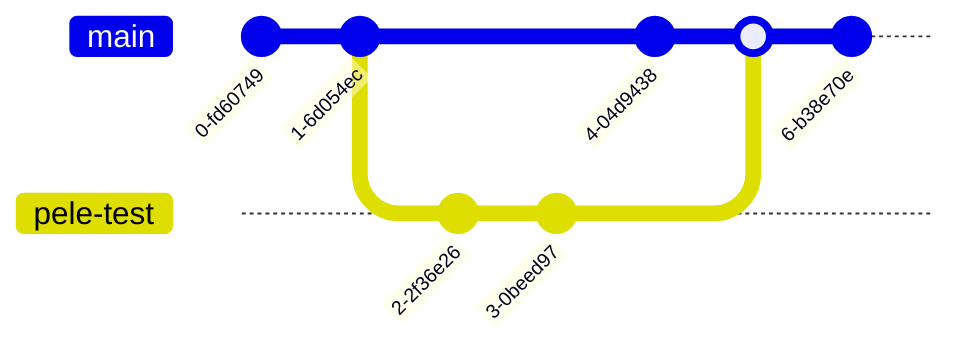
```mermaid
gitGraph
    commit
    commit
    branch pele-test
    checkout pele-test
    commit
    commit
    checkout main
    commit
    merge pele-test
    commit
```

---

## Quadrant chart

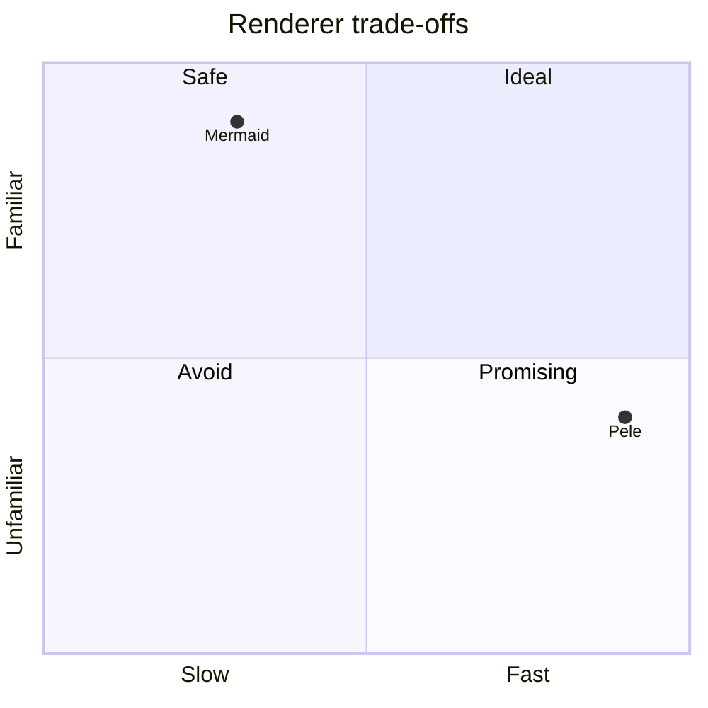
```mermaid
quadrantChart
    title Renderer trade-offs
    x-axis Slow --> Fast
    y-axis Unfamiliar --> Familiar
    quadrant-1 Ideal
    quadrant-2 Safe
    quadrant-3 Avoid
    quadrant-4 Promising
    Mermaid: [0.3, 0.9]
    Pele: [0.9, 0.4]
```

---

## XY chart

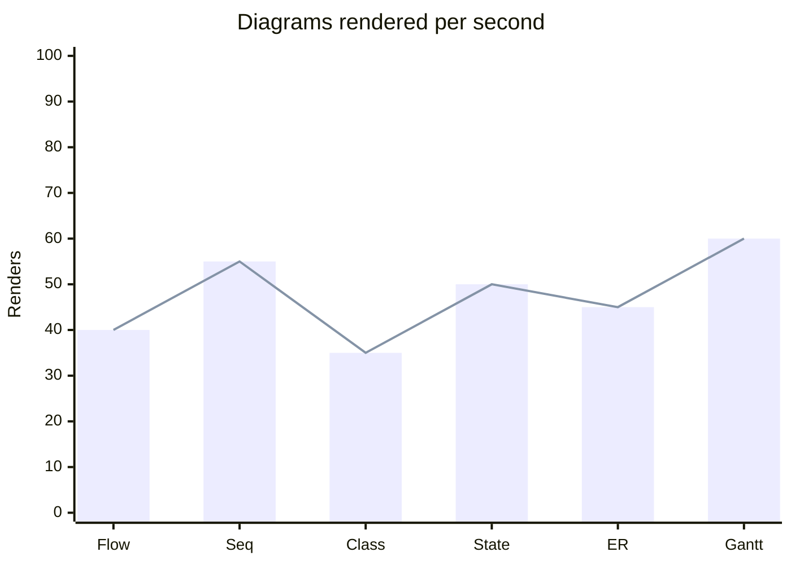
```mermaid
xychart-beta
    title "Diagrams rendered per second"
    x-axis [Flow, Seq, Class, State, ER, Gantt]
    y-axis "Renders" 0 --> 100
    bar [40, 55, 35, 50, 45, 60]
    line [40, 55, 35, 50, 45, 60]
```

---

## Sankey

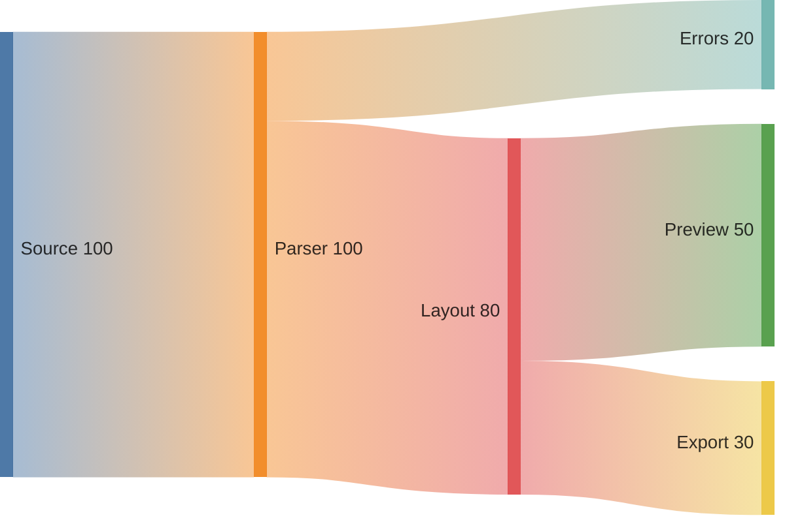
```mermaid
sankey-beta
Source,Parser,100
Parser,Layout,80
Parser,Errors,20
Layout,Preview,50
Layout,Export,30
```

---

## Requirement diagram

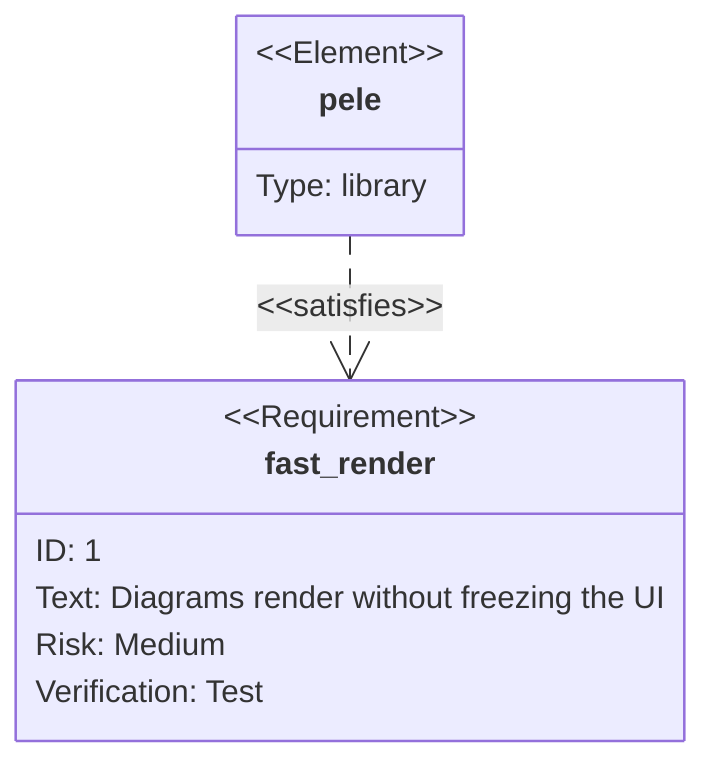
```mermaid
requirementDiagram
    requirement fast_render {
        id: 1
        text: Diagrams render without freezing the UI
        risk: medium
        verifymethod: test
    }
    element pele {
        type: library
    }
    pele - satisfies -> fast_render
```

---

## C4 context

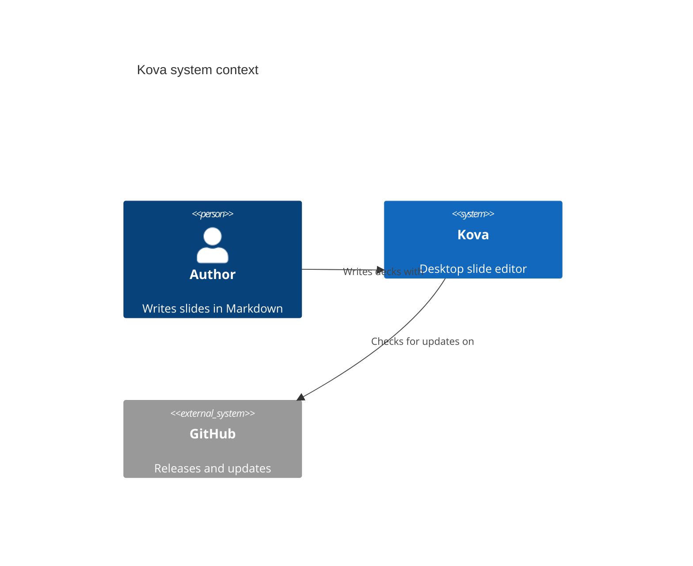
```mermaid
C4Context
    title Kova system context
    Person(author, "Author", "Writes slides in Markdown")
    System(kova, "Kova", "Desktop slide editor")
    System_Ext(gh, "GitHub", "Releases and updates")
    Rel(author, kova, "Writes decks with")
    Rel(kova, gh, "Checks for updates on")
```

---

## Block diagram

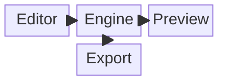
```mermaid
block-beta
    columns 3
    a["Editor"] b["Engine"] c["Preview"]
    space d["Export"] space
    a --> b
    b --> c
    b --> d
```

---

## Packet

```mermaid
packet-beta
    title Slide header
    0-15: "Source port"
    16-31: "Destination port"
    32-63: "Sequence number"
```

---

## Architecture

```mermaid
architecture-beta
    group app(cloud)[Kova]
    service editor(server)[Editor] in app
    service engine(server)[Engine] in app
    service disk(disk)[Files] in app
    editor:R --> L:engine
    engine:B --> T:disk
```

---

## Kanban

```mermaid
kanban
    todo[To do]
        t1[Theme mapping]
        t2[WebKitGTK check]
    doing[In progress]
        d1[Pele prototype]
    done[Done]
        f1[Settings toggle]
```

---

## Radar

```mermaid
radar-beta
    title Renderer comparison
    axis speed["Speed"], size["Size"], fidelity["Fidelity"], theming["Theming"], maturity["Maturity"]
    curve mermaid["Mermaid"]{2, 1, 5, 3, 5}
    curve pele["Pele"]{5, 5, 3, 5, 2}
    max 5
```

---

## Treemap

```mermaid
treemap-beta
"Bundle"
    "Mermaid": 84
    "Pele": 2
    "Other"
        "React": 4
        "CodeMirror": 6
```

---

## Edge case: classDef and style

Colours set in the diagram itself must win over the theme.

```mermaid
flowchart LR
    A[Default] --> B[Warning] --> C[Success]
    classDef warn fill:#f9d67a,stroke:#8a6d00,color:#3b2f00
    classDef ok fill:#9be3a8,stroke:#1e7a32,color:#0b3315
    class B warn
    class C ok
    linkStyle 0 stroke:#d33,stroke-width:3px
```

---

## Edge case: own init pragma

This diagram brings its own themeVariables, so the Kova theme should not override them.

```mermaid
%%{init: {"theme": "base", "themeVariables": {"primaryColor": "#ffe0f0", "lineColor": "#c2185b", "primaryBorderColor": "#c2185b"}}}%%
flowchart LR
    A[Pink nodes] --> B[Pink edges]
```

---

## Edge case: long labels and line breaks

```mermaid
flowchart TB
    A["A very long node label that should wrap rather than run off the side of the slide"] --> B["Line one<br/>Line two<br/>Line three"]
    B --> C["Unicode: café, naïve, Žiga, 日本語, émojis aside"]
```

---

## Edge case: large flowchart

```mermaid
flowchart LR
    S1 --> S2 --> S3 --> S4 --> S5 --> S6 --> S7 --> S8
    S2 --> B1 --> B2 --> B3 --> S6
    S4 --> C1 --> C2 --> S8
    S1 --> D1 --> D2 --> D3 --> D4 --> S5
    S3 --> E1 --> E2 --> S7
```

---

## Split: text beside a diagram

- Pele renders synchronously
- Theme colours are baked into the SVG
- Unknown diagram types fall back to Mermaid

|||

```mermaid
sequenceDiagram
    Kova->>Pele: render(source)
    Pele-->>Kova: SVG
```

---

## Two diagrams side by side

```mermaid
pie
    title Before
    "Mermaid" : 84
    "Rest" : 16
```

|||

```mermaid
pie
    title After
    "Pele" : 2
    "Rest" : 16
```
