# Performance stress deck

65 slides of Mermaid diagrams (every type, each one distinct), overflowing multi-column and BSP layouts, unlabelled code blocks and KaTeX. Used to reproduce the WebKitGTK freeze when opening large, diagram-heavy decks. Regenerate rather than hand-edit.

---

## 2. Two columns, one overflowing

- Point 1 on slide 2: enough words that this line wraps across the slide width and pushes the pane into overflow
- Point 2 on slide 2: enough words that this line wraps across the slide width and pushes the pane into overflow
- Point 3 on slide 2: enough words that this line wraps across the slide width and pushes the pane into overflow
- Point 4 on slide 2: enough words that this line wraps across the slide width and pushes the pane into overflow
- Point 5 on slide 2: enough words that this line wraps across the slide width and pushes the pane into overflow
- Point 6 on slide 2: enough words that this line wraps across the slide width and pushes the pane into overflow
- Point 7 on slide 2: enough words that this line wraps across the slide width and pushes the pane into overflow
- Point 8 on slide 2: enough words that this line wraps across the slide width and pushes the pane into overflow
- Point 9 on slide 2: enough words that this line wraps across the slide width and pushes the pane into overflow
- Point 10 on slide 2: enough words that this line wraps across the slide width and pushes the pane into overflow
- Point 11 on slide 2: enough words that this line wraps across the slide width and pushes the pane into overflow
- Point 12 on slide 2: enough words that this line wraps across the slide width and pushes the pane into overflow
- Point 13 on slide 2: enough words that this line wraps across the slide width and pushes the pane into overflow
- Point 14 on slide 2: enough words that this line wraps across the slide width and pushes the pane into overflow

|||

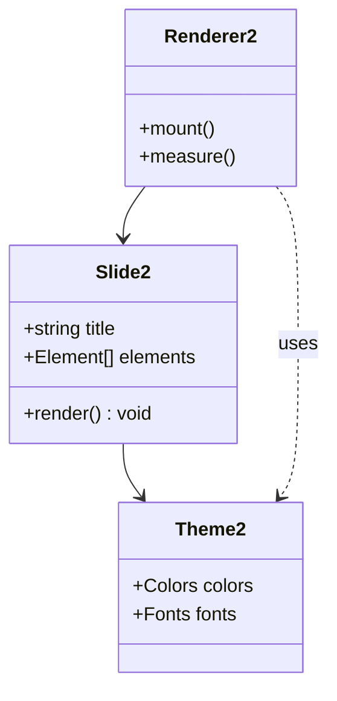

---

## 3. Three columns

- Point 1 on slide 3: enough words that this line wraps across the slide width and pushes the pane into overflow
- Point 2 on slide 3: enough words that this line wraps across the slide width and pushes the pane into overflow
- Point 3 on slide 3: enough words that this line wraps across the slide width and pushes the pane into overflow
- Point 4 on slide 3: enough words that this line wraps across the slide width and pushes the pane into overflow
- Point 5 on slide 3: enough words that this line wraps across the slide width and pushes the pane into overflow
- Point 6 on slide 3: enough words that this line wraps across the slide width and pushes the pane into overflow
- Point 7 on slide 3: enough words that this line wraps across the slide width and pushes the pane into overflow
- Point 8 on slide 3: enough words that this line wraps across the slide width and pushes the pane into overflow

|||


|||

- Point 1 on slide 4: enough words that this line wraps across the slide width and pushes the pane into overflow
- Point 2 on slide 4: enough words that this line wraps across the slide width and pushes the pane into overflow
- Point 3 on slide 4: enough words that this line wraps across the slide width and pushes the pane into overflow
- Point 4 on slide 4: enough words that this line wraps across the slide width and pushes the pane into overflow
- Point 5 on slide 4: enough words that this line wraps across the slide width and pushes the pane into overflow
- Point 6 on slide 4: enough words that this line wraps across the slide width and pushes the pane into overflow
- Point 7 on slide 4: enough words that this line wraps across the slide width and pushes the pane into overflow
- Point 8 on slide 4: enough words that this line wraps across the slide width and pushes the pane into overflow

---

## 4. Two diagrams

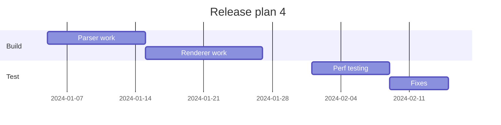

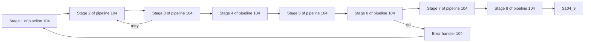

---

## 5. Code and maths

```
function renderSlide5(slide, theme) {
  const panes = slide.elements.filter((e) => e.type !== 'image');
  for (const pane of panes) {
    measure(pane);
    if (pane.height > available) shrink(pane, 5);
  }
  return panes.map((p) => draw(p, theme));
}
```

$$
\sum_{i=1}^{5} \frac{x_i^2}{\sqrt{1 + y_i}} = \int_0^{5} e^{-t^2} \, dt
$$

---

## 6. Dense text

- Point 1 on slide 6: enough words that this line wraps across the slide width and pushes the pane into overflow
- Point 2 on slide 6: enough words that this line wraps across the slide width and pushes the pane into overflow
- Point 3 on slide 6: enough words that this line wraps across the slide width and pushes the pane into overflow
- Point 4 on slide 6: enough words that this line wraps across the slide width and pushes the pane into overflow
- Point 5 on slide 6: enough words that this line wraps across the slide width and pushes the pane into overflow
- Point 6 on slide 6: enough words that this line wraps across the slide width and pushes the pane into overflow
- Point 7 on slide 6: enough words that this line wraps across the slide width and pushes the pane into overflow
- Point 8 on slide 6: enough words that this line wraps across the slide width and pushes the pane into overflow
- Point 9 on slide 6: enough words that this line wraps across the slide width and pushes the pane into overflow
- Point 10 on slide 6: enough words that this line wraps across the slide width and pushes the pane into overflow
- Point 11 on slide 6: enough words that this line wraps across the slide width and pushes the pane into overflow
- Point 12 on slide 6: enough words that this line wraps across the slide width and pushes the pane into overflow
- Point 13 on slide 6: enough words that this line wraps across the slide width and pushes the pane into overflow
- Point 14 on slide 6: enough words that this line wraps across the slide width and pushes the pane into overflow
- Point 15 on slide 6: enough words that this line wraps across the slide width and pushes the pane into overflow
- Point 16 on slide 6: enough words that this line wraps across the slide width and pushes the pane into overflow
- Point 17 on slide 6: enough words that this line wraps across the slide width and pushes the pane into overflow
- Point 18 on slide 6: enough words that this line wraps across the slide width and pushes the pane into overflow
- Point 19 on slide 6: enough words that this line wraps across the slide width and pushes the pane into overflow
- Point 20 on slide 6: enough words that this line wraps across the slide width and pushes the pane into overflow
- Point 21 on slide 6: enough words that this line wraps across the slide width and pushes the pane into overflow
- Point 22 on slide 6: enough words that this line wraps across the slide width and pushes the pane into overflow

---

## 7. Table and diagram

| Item | Time | Count | Cached |
|---|---|---|---|
| Slide 7.1 | 7 ms | 3 | yes |
| Slide 7.2 | 1 ms | 6 | no |
| Slide 7.3 | 8 ms | 9 | yes |
| Slide 7.4 | 2 ms | 12 | no |
| Slide 7.5 | 9 ms | 15 | yes |
| Slide 7.6 | 3 ms | 18 | no |
| Slide 7.7 | 10 ms | 21 | yes |
| Slide 7.8 | 4 ms | 24 | no |

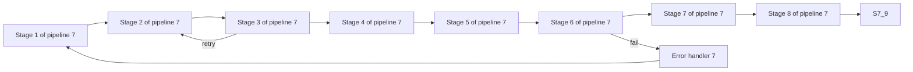

---

## 8. Steps over a diagram

- Shown first <!-- step -->
- Shown second <!-- step -->

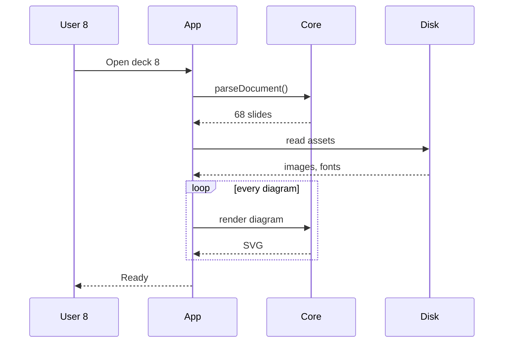

---

## 9. Diagram only

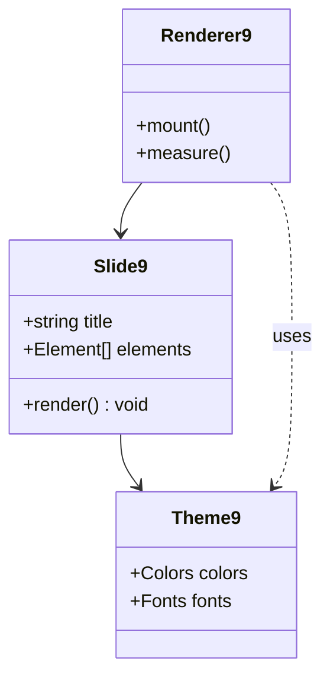

---

## 10. Text beside a diagram

This slide pairs explanatory text with a diagram, which auto-layout puts in a BSP split.

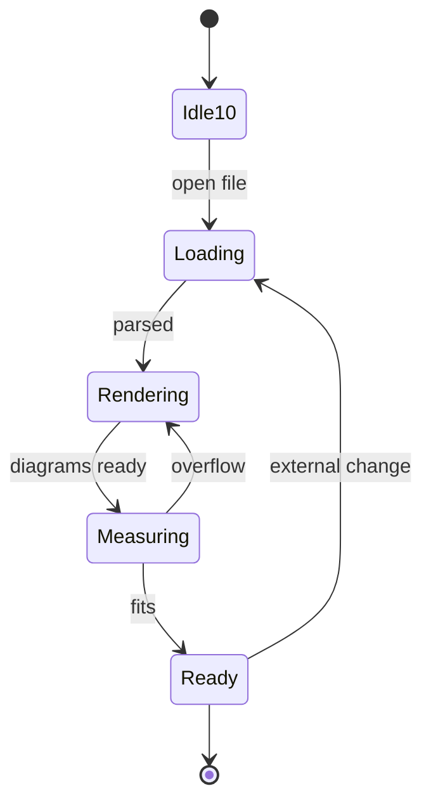

---

## 11. Two columns, one overflowing

- Point 1 on slide 11: enough words that this line wraps across the slide width and pushes the pane into overflow
- Point 2 on slide 11: enough words that this line wraps across the slide width and pushes the pane into overflow
- Point 3 on slide 11: enough words that this line wraps across the slide width and pushes the pane into overflow
- Point 4 on slide 11: enough words that this line wraps across the slide width and pushes the pane into overflow
- Point 5 on slide 11: enough words that this line wraps across the slide width and pushes the pane into overflow
- Point 6 on slide 11: enough words that this line wraps across the slide width and pushes the pane into overflow
- Point 7 on slide 11: enough words that this line wraps across the slide width and pushes the pane into overflow
- Point 8 on slide 11: enough words that this line wraps across the slide width and pushes the pane into overflow
- Point 9 on slide 11: enough words that this line wraps across the slide width and pushes the pane into overflow
- Point 10 on slide 11: enough words that this line wraps across the slide width and pushes the pane into overflow
- Point 11 on slide 11: enough words that this line wraps across the slide width and pushes the pane into overflow
- Point 12 on slide 11: enough words that this line wraps across the slide width and pushes the pane into overflow
- Point 13 on slide 11: enough words that this line wraps across the slide width and pushes the pane into overflow
- Point 14 on slide 11: enough words that this line wraps across the slide width and pushes the pane into overflow

|||


---

## 12. Three columns

- Point 1 on slide 12: enough words that this line wraps across the slide width and pushes the pane into overflow
- Point 2 on slide 12: enough words that this line wraps across the slide width and pushes the pane into overflow
- Point 3 on slide 12: enough words that this line wraps across the slide width and pushes the pane into overflow
- Point 4 on slide 12: enough words that this line wraps across the slide width and pushes the pane into overflow
- Point 5 on slide 12: enough words that this line wraps across the slide width and pushes the pane into overflow
- Point 6 on slide 12: enough words that this line wraps across the slide width and pushes the pane into overflow
- Point 7 on slide 12: enough words that this line wraps across the slide width and pushes the pane into overflow
- Point 8 on slide 12: enough words that this line wraps across the slide width and pushes the pane into overflow

|||

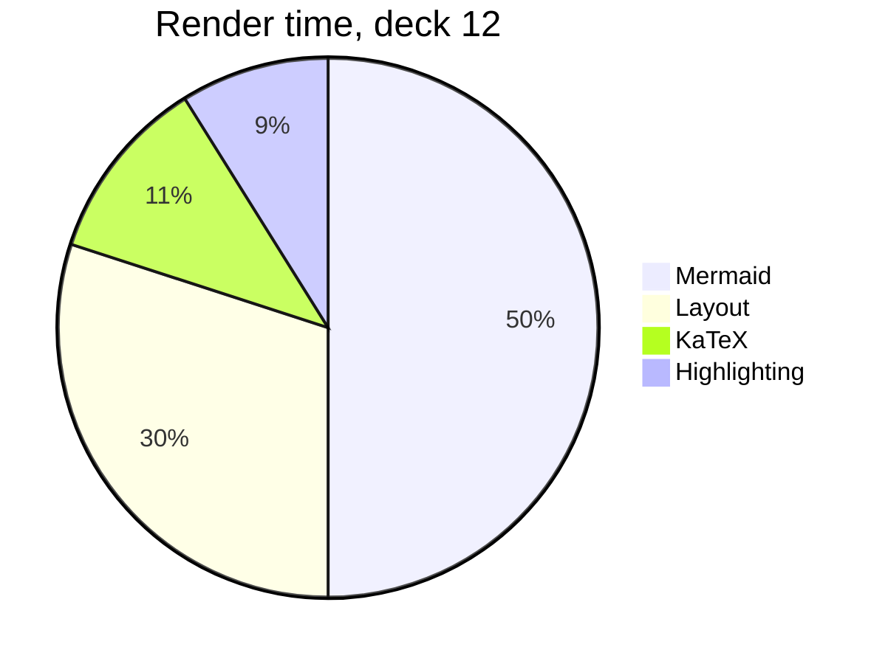

|||

- Point 1 on slide 13: enough words that this line wraps across the slide width and pushes the pane into overflow
- Point 2 on slide 13: enough words that this line wraps across the slide width and pushes the pane into overflow
- Point 3 on slide 13: enough words that this line wraps across the slide width and pushes the pane into overflow
- Point 4 on slide 13: enough words that this line wraps across the slide width and pushes the pane into overflow
- Point 5 on slide 13: enough words that this line wraps across the slide width and pushes the pane into overflow
- Point 6 on slide 13: enough words that this line wraps across the slide width and pushes the pane into overflow
- Point 7 on slide 13: enough words that this line wraps across the slide width and pushes the pane into overflow
- Point 8 on slide 13: enough words that this line wraps across the slide width and pushes the pane into overflow

---

## 13. Two diagrams


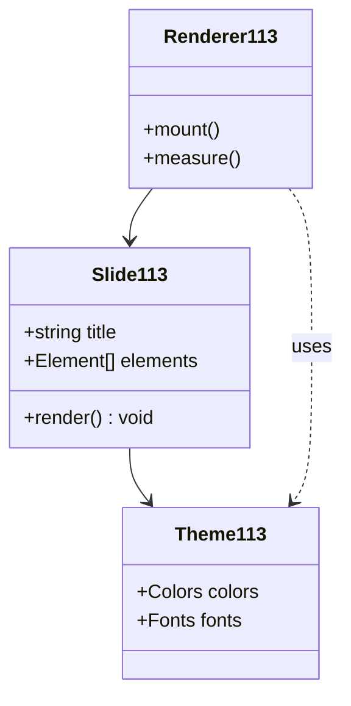

---

## 14. Code and maths

```
function renderSlide14(slide, theme) {
  const panes = slide.elements.filter((e) => e.type !== 'image');
  for (const pane of panes) {
    measure(pane);
    if (pane.height > available) shrink(pane, 14);
  }
  return panes.map((p) => draw(p, theme));
}
```

$$
\sum_{i=1}^{14} \frac{x_i^2}{\sqrt{1 + y_i}} = \int_0^{14} e^{-t^2} \, dt
$$

---

## 15. Dense text

- Point 1 on slide 15: enough words that this line wraps across the slide width and pushes the pane into overflow
- Point 2 on slide 15: enough words that this line wraps across the slide width and pushes the pane into overflow
- Point 3 on slide 15: enough words that this line wraps across the slide width and pushes the pane into overflow
- Point 4 on slide 15: enough words that this line wraps across the slide width and pushes the pane into overflow
- Point 5 on slide 15: enough words that this line wraps across the slide width and pushes the pane into overflow
- Point 6 on slide 15: enough words that this line wraps across the slide width and pushes the pane into overflow
- Point 7 on slide 15: enough words that this line wraps across the slide width and pushes the pane into overflow
- Point 8 on slide 15: enough words that this line wraps across the slide width and pushes the pane into overflow
- Point 9 on slide 15: enough words that this line wraps across the slide width and pushes the pane into overflow
- Point 10 on slide 15: enough words that this line wraps across the slide width and pushes the pane into overflow
- Point 11 on slide 15: enough words that this line wraps across the slide width and pushes the pane into overflow
- Point 12 on slide 15: enough words that this line wraps across the slide width and pushes the pane into overflow
- Point 13 on slide 15: enough words that this line wraps across the slide width and pushes the pane into overflow
- Point 14 on slide 15: enough words that this line wraps across the slide width and pushes the pane into overflow
- Point 15 on slide 15: enough words that this line wraps across the slide width and pushes the pane into overflow
- Point 16 on slide 15: enough words that this line wraps across the slide width and pushes the pane into overflow
- Point 17 on slide 15: enough words that this line wraps across the slide width and pushes the pane into overflow
- Point 18 on slide 15: enough words that this line wraps across the slide width and pushes the pane into overflow
- Point 19 on slide 15: enough words that this line wraps across the slide width and pushes the pane into overflow
- Point 20 on slide 15: enough words that this line wraps across the slide width and pushes the pane into overflow
- Point 21 on slide 15: enough words that this line wraps across the slide width and pushes the pane into overflow
- Point 22 on slide 15: enough words that this line wraps across the slide width and pushes the pane into overflow

---

## 16. Table and diagram

| Item | Time | Count | Cached |
|---|---|---|---|
| Slide 16.1 | 7 ms | 3 | yes |
| Slide 16.2 | 1 ms | 6 | no |
| Slide 16.3 | 8 ms | 9 | yes |
| Slide 16.4 | 2 ms | 12 | no |
| Slide 16.5 | 9 ms | 15 | yes |
| Slide 16.6 | 3 ms | 18 | no |
| Slide 16.7 | 10 ms | 21 | yes |
| Slide 16.8 | 4 ms | 24 | no |


---

## 17. Steps over a diagram

- Shown first <!-- step -->
- Shown second <!-- step -->

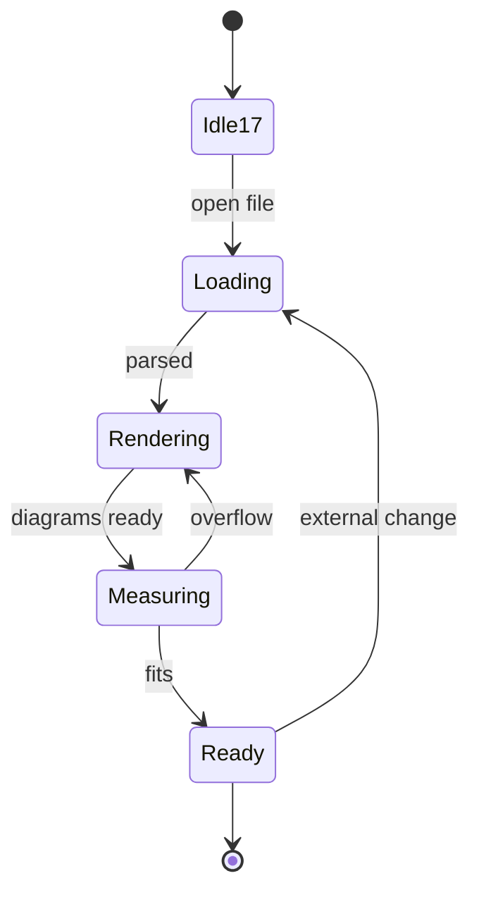

---

## 18. Diagram only

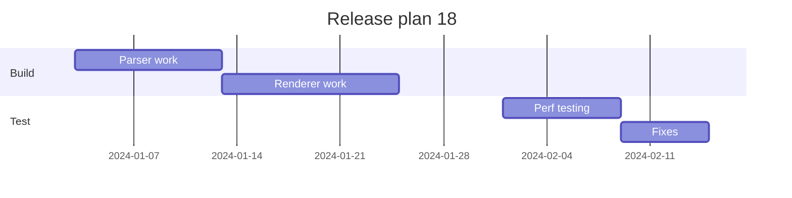

---

## 19. Text beside a diagram

This slide pairs explanatory text with a diagram, which auto-layout puts in a BSP split.

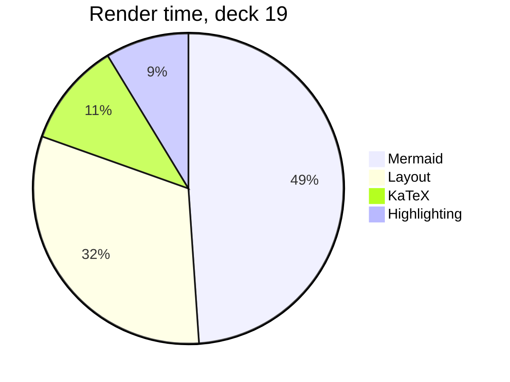

---

## 20. Two columns, one overflowing

- Point 1 on slide 20: enough words that this line wraps across the slide width and pushes the pane into overflow
- Point 2 on slide 20: enough words that this line wraps across the slide width and pushes the pane into overflow
- Point 3 on slide 20: enough words that this line wraps across the slide width and pushes the pane into overflow
- Point 4 on slide 20: enough words that this line wraps across the slide width and pushes the pane into overflow
- Point 5 on slide 20: enough words that this line wraps across the slide width and pushes the pane into overflow
- Point 6 on slide 20: enough words that this line wraps across the slide width and pushes the pane into overflow
- Point 7 on slide 20: enough words that this line wraps across the slide width and pushes the pane into overflow
- Point 8 on slide 20: enough words that this line wraps across the slide width and pushes the pane into overflow
- Point 9 on slide 20: enough words that this line wraps across the slide width and pushes the pane into overflow
- Point 10 on slide 20: enough words that this line wraps across the slide width and pushes the pane into overflow
- Point 11 on slide 20: enough words that this line wraps across the slide width and pushes the pane into overflow
- Point 12 on slide 20: enough words that this line wraps across the slide width and pushes the pane into overflow
- Point 13 on slide 20: enough words that this line wraps across the slide width and pushes the pane into overflow
- Point 14 on slide 20: enough words that this line wraps across the slide width and pushes the pane into overflow

|||

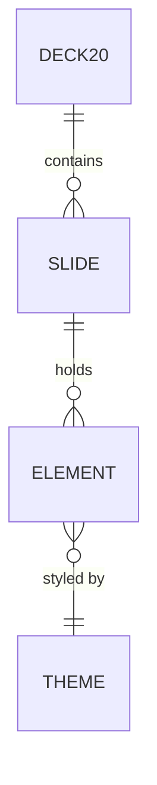

---

## 21. Three columns

- Point 1 on slide 21: enough words that this line wraps across the slide width and pushes the pane into overflow
- Point 2 on slide 21: enough words that this line wraps across the slide width and pushes the pane into overflow
- Point 3 on slide 21: enough words that this line wraps across the slide width and pushes the pane into overflow
- Point 4 on slide 21: enough words that this line wraps across the slide width and pushes the pane into overflow
- Point 5 on slide 21: enough words that this line wraps across the slide width and pushes the pane into overflow
- Point 6 on slide 21: enough words that this line wraps across the slide width and pushes the pane into overflow
- Point 7 on slide 21: enough words that this line wraps across the slide width and pushes the pane into overflow
- Point 8 on slide 21: enough words that this line wraps across the slide width and pushes the pane into overflow

|||

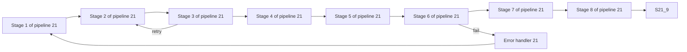

|||

- Point 1 on slide 22: enough words that this line wraps across the slide width and pushes the pane into overflow
- Point 2 on slide 22: enough words that this line wraps across the slide width and pushes the pane into overflow
- Point 3 on slide 22: enough words that this line wraps across the slide width and pushes the pane into overflow
- Point 4 on slide 22: enough words that this line wraps across the slide width and pushes the pane into overflow
- Point 5 on slide 22: enough words that this line wraps across the slide width and pushes the pane into overflow
- Point 6 on slide 22: enough words that this line wraps across the slide width and pushes the pane into overflow
- Point 7 on slide 22: enough words that this line wraps across the slide width and pushes the pane into overflow
- Point 8 on slide 22: enough words that this line wraps across the slide width and pushes the pane into overflow

---

## 22. Two diagrams


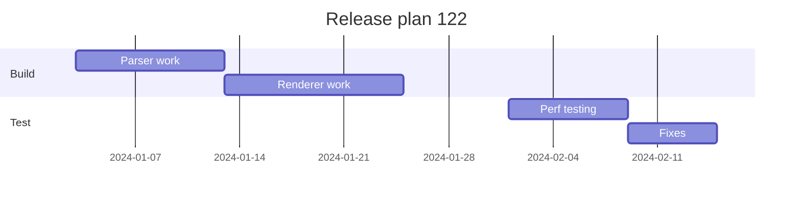

---

## 23. Code and maths

```
function renderSlide23(slide, theme) {
  const panes = slide.elements.filter((e) => e.type !== 'image');
  for (const pane of panes) {
    measure(pane);
    if (pane.height > available) shrink(pane, 23);
  }
  return panes.map((p) => draw(p, theme));
}
```

$$
\sum_{i=1}^{23} \frac{x_i^2}{\sqrt{1 + y_i}} = \int_0^{23} e^{-t^2} \, dt
$$

---

## 24. Dense text

- Point 1 on slide 24: enough words that this line wraps across the slide width and pushes the pane into overflow
- Point 2 on slide 24: enough words that this line wraps across the slide width and pushes the pane into overflow
- Point 3 on slide 24: enough words that this line wraps across the slide width and pushes the pane into overflow
- Point 4 on slide 24: enough words that this line wraps across the slide width and pushes the pane into overflow
- Point 5 on slide 24: enough words that this line wraps across the slide width and pushes the pane into overflow
- Point 6 on slide 24: enough words that this line wraps across the slide width and pushes the pane into overflow
- Point 7 on slide 24: enough words that this line wraps across the slide width and pushes the pane into overflow
- Point 8 on slide 24: enough words that this line wraps across the slide width and pushes the pane into overflow
- Point 9 on slide 24: enough words that this line wraps across the slide width and pushes the pane into overflow
- Point 10 on slide 24: enough words that this line wraps across the slide width and pushes the pane into overflow
- Point 11 on slide 24: enough words that this line wraps across the slide width and pushes the pane into overflow
- Point 12 on slide 24: enough words that this line wraps across the slide width and pushes the pane into overflow
- Point 13 on slide 24: enough words that this line wraps across the slide width and pushes the pane into overflow
- Point 14 on slide 24: enough words that this line wraps across the slide width and pushes the pane into overflow
- Point 15 on slide 24: enough words that this line wraps across the slide width and pushes the pane into overflow
- Point 16 on slide 24: enough words that this line wraps across the slide width and pushes the pane into overflow
- Point 17 on slide 24: enough words that this line wraps across the slide width and pushes the pane into overflow
- Point 18 on slide 24: enough words that this line wraps across the slide width and pushes the pane into overflow
- Point 19 on slide 24: enough words that this line wraps across the slide width and pushes the pane into overflow
- Point 20 on slide 24: enough words that this line wraps across the slide width and pushes the pane into overflow
- Point 21 on slide 24: enough words that this line wraps across the slide width and pushes the pane into overflow
- Point 22 on slide 24: enough words that this line wraps across the slide width and pushes the pane into overflow

---

## 25. Table and diagram

| Item | Time | Count | Cached |
|---|---|---|---|
| Slide 25.1 | 7 ms | 3 | yes |
| Slide 25.2 | 1 ms | 6 | no |
| Slide 25.3 | 8 ms | 9 | yes |
| Slide 25.4 | 2 ms | 12 | no |
| Slide 25.5 | 9 ms | 15 | yes |
| Slide 25.6 | 3 ms | 18 | no |
| Slide 25.7 | 10 ms | 21 | yes |
| Slide 25.8 | 4 ms | 24 | no |

```mermaid
gantt
    title Release plan 25
    dateFormat YYYY-MM-DD
    section Build
    Parser work      :a25, 2024-01-02, 10d
    Renderer work    :after a25, 12d
    section Test
    Perf testing     :b25, 2024-02-01, 8d
    Fixes            :after b25, 6d
```

---

## 26. Steps over a diagram

- Shown first <!-- step -->
- Shown second <!-- step -->

```mermaid
pie title Render time, deck 26
    "Mermaid" : 45
    "Layout" : 26
    "KaTeX" : 10
    "Highlighting" : 8
```

---

## 27. Diagram only

```mermaid
erDiagram
    DECK27 ||--o{ SLIDE : contains
    SLIDE ||--o{ ELEMENT : holds
    ELEMENT }o--|| THEME : "styled by"
```

---

## 28. Text beside a diagram

This slide pairs explanatory text with a diagram, which auto-layout puts in a BSP split.

```mermaid
flowchart LR
    S28_1[Stage 1 of pipeline 28] --> S28_2
    S28_2[Stage 2 of pipeline 28] --> S28_3
    S28_3[Stage 3 of pipeline 28] --> S28_4
    S28_4[Stage 4 of pipeline 28] --> S28_5
    S28_5[Stage 5 of pipeline 28] --> S28_6
    S28_6[Stage 6 of pipeline 28] --> S28_7
    S28_7[Stage 7 of pipeline 28] --> S28_8
    S28_8[Stage 8 of pipeline 28] --> S28_9
    S28_3 -->|retry| S28_2
    S28_6 -->|fail| E28[Error handler 28]
    E28 --> S28_1
```

---

## 29. Two columns, one overflowing

- Point 1 on slide 29: enough words that this line wraps across the slide width and pushes the pane into overflow
- Point 2 on slide 29: enough words that this line wraps across the slide width and pushes the pane into overflow
- Point 3 on slide 29: enough words that this line wraps across the slide width and pushes the pane into overflow
- Point 4 on slide 29: enough words that this line wraps across the slide width and pushes the pane into overflow
- Point 5 on slide 29: enough words that this line wraps across the slide width and pushes the pane into overflow
- Point 6 on slide 29: enough words that this line wraps across the slide width and pushes the pane into overflow
- Point 7 on slide 29: enough words that this line wraps across the slide width and pushes the pane into overflow
- Point 8 on slide 29: enough words that this line wraps across the slide width and pushes the pane into overflow
- Point 9 on slide 29: enough words that this line wraps across the slide width and pushes the pane into overflow
- Point 10 on slide 29: enough words that this line wraps across the slide width and pushes the pane into overflow
- Point 11 on slide 29: enough words that this line wraps across the slide width and pushes the pane into overflow
- Point 12 on slide 29: enough words that this line wraps across the slide width and pushes the pane into overflow
- Point 13 on slide 29: enough words that this line wraps across the slide width and pushes the pane into overflow
- Point 14 on slide 29: enough words that this line wraps across the slide width and pushes the pane into overflow

|||

```mermaid
sequenceDiagram
    participant U as User 29
    participant A as App
    participant C as Core
    participant D as Disk
    U->>A: Open deck 29
    A->>C: parseDocument()
    C-->>A: 89 slides
    A->>D: read assets
    D-->>A: images, fonts
    loop every diagram
        A->>C: render diagram
        C-->>A: SVG
    end
    A-->>U: Ready
```

---

## 30. Three columns

- Point 1 on slide 30: enough words that this line wraps across the slide width and pushes the pane into overflow
- Point 2 on slide 30: enough words that this line wraps across the slide width and pushes the pane into overflow
- Point 3 on slide 30: enough words that this line wraps across the slide width and pushes the pane into overflow
- Point 4 on slide 30: enough words that this line wraps across the slide width and pushes the pane into overflow
- Point 5 on slide 30: enough words that this line wraps across the slide width and pushes the pane into overflow
- Point 6 on slide 30: enough words that this line wraps across the slide width and pushes the pane into overflow
- Point 7 on slide 30: enough words that this line wraps across the slide width and pushes the pane into overflow
- Point 8 on slide 30: enough words that this line wraps across the slide width and pushes the pane into overflow

|||

```mermaid
classDiagram
    class Slide30 {
      +string title
      +Element[] elements
      +render() void
    }
    class Theme30 {
      +Colors colors
      +Fonts fonts
    }
    class Renderer30 {
      +mount()
      +measure()
    }
    Slide30 --> Theme30
    Renderer30 --> Slide30
    Renderer30 ..> Theme30 : uses
```

|||

- Point 1 on slide 31: enough words that this line wraps across the slide width and pushes the pane into overflow
- Point 2 on slide 31: enough words that this line wraps across the slide width and pushes the pane into overflow
- Point 3 on slide 31: enough words that this line wraps across the slide width and pushes the pane into overflow
- Point 4 on slide 31: enough words that this line wraps across the slide width and pushes the pane into overflow
- Point 5 on slide 31: enough words that this line wraps across the slide width and pushes the pane into overflow
- Point 6 on slide 31: enough words that this line wraps across the slide width and pushes the pane into overflow
- Point 7 on slide 31: enough words that this line wraps across the slide width and pushes the pane into overflow
- Point 8 on slide 31: enough words that this line wraps across the slide width and pushes the pane into overflow

---

## 31. Two diagrams

```mermaid
stateDiagram-v2
    [*] --> Idle31
    Idle31 --> Loading : open file
    Loading --> Rendering : parsed
    Rendering --> Measuring : diagrams ready
    Measuring --> Rendering : overflow
    Measuring --> Ready : fits
    Ready --> Loading : external change
    Ready --> [*]
```

```mermaid
erDiagram
    DECK131 ||--o{ SLIDE : contains
    SLIDE ||--o{ ELEMENT : holds
    ELEMENT }o--|| THEME : "styled by"
```

---

## 32. Code and maths

```
function renderSlide32(slide, theme) {
  const panes = slide.elements.filter((e) => e.type !== 'image');
  for (const pane of panes) {
    measure(pane);
    if (pane.height > available) shrink(pane, 32);
  }
  return panes.map((p) => draw(p, theme));
}
```

$$
\sum_{i=1}^{32} \frac{x_i^2}{\sqrt{1 + y_i}} = \int_0^{32} e^{-t^2} \, dt
$$

---

## 33. Dense text

- Point 1 on slide 33: enough words that this line wraps across the slide width and pushes the pane into overflow
- Point 2 on slide 33: enough words that this line wraps across the slide width and pushes the pane into overflow
- Point 3 on slide 33: enough words that this line wraps across the slide width and pushes the pane into overflow
- Point 4 on slide 33: enough words that this line wraps across the slide width and pushes the pane into overflow
- Point 5 on slide 33: enough words that this line wraps across the slide width and pushes the pane into overflow
- Point 6 on slide 33: enough words that this line wraps across the slide width and pushes the pane into overflow
- Point 7 on slide 33: enough words that this line wraps across the slide width and pushes the pane into overflow
- Point 8 on slide 33: enough words that this line wraps across the slide width and pushes the pane into overflow
- Point 9 on slide 33: enough words that this line wraps across the slide width and pushes the pane into overflow
- Point 10 on slide 33: enough words that this line wraps across the slide width and pushes the pane into overflow
- Point 11 on slide 33: enough words that this line wraps across the slide width and pushes the pane into overflow
- Point 12 on slide 33: enough words that this line wraps across the slide width and pushes the pane into overflow
- Point 13 on slide 33: enough words that this line wraps across the slide width and pushes the pane into overflow
- Point 14 on slide 33: enough words that this line wraps across the slide width and pushes the pane into overflow
- Point 15 on slide 33: enough words that this line wraps across the slide width and pushes the pane into overflow
- Point 16 on slide 33: enough words that this line wraps across the slide width and pushes the pane into overflow
- Point 17 on slide 33: enough words that this line wraps across the slide width and pushes the pane into overflow
- Point 18 on slide 33: enough words that this line wraps across the slide width and pushes the pane into overflow
- Point 19 on slide 33: enough words that this line wraps across the slide width and pushes the pane into overflow
- Point 20 on slide 33: enough words that this line wraps across the slide width and pushes the pane into overflow
- Point 21 on slide 33: enough words that this line wraps across the slide width and pushes the pane into overflow
- Point 22 on slide 33: enough words that this line wraps across the slide width and pushes the pane into overflow

---

## 34. Table and diagram

| Item | Time | Count | Cached |
|---|---|---|---|
| Slide 34.1 | 7 ms | 3 | yes |
| Slide 34.2 | 1 ms | 6 | no |
| Slide 34.3 | 8 ms | 9 | yes |
| Slide 34.4 | 2 ms | 12 | no |
| Slide 34.5 | 9 ms | 15 | yes |
| Slide 34.6 | 3 ms | 18 | no |
| Slide 34.7 | 10 ms | 21 | yes |
| Slide 34.8 | 4 ms | 24 | no |

```mermaid
erDiagram
    DECK34 ||--o{ SLIDE : contains
    SLIDE ||--o{ ELEMENT : holds
    ELEMENT }o--|| THEME : "styled by"
```

---

## 35. Steps over a diagram

- Shown first <!-- step -->
- Shown second <!-- step -->

```mermaid
flowchart LR
    S35_1[Stage 1 of pipeline 35] --> S35_2
    S35_2[Stage 2 of pipeline 35] --> S35_3
    S35_3[Stage 3 of pipeline 35] --> S35_4
    S35_4[Stage 4 of pipeline 35] --> S35_5
    S35_5[Stage 5 of pipeline 35] --> S35_6
    S35_6[Stage 6 of pipeline 35] --> S35_7
    S35_7[Stage 7 of pipeline 35] --> S35_8
    S35_8[Stage 8 of pipeline 35] --> S35_9
    S35_3 -->|retry| S35_2
    S35_6 -->|fail| E35[Error handler 35]
    E35 --> S35_1
```

---

## 36. Diagram only

```mermaid
sequenceDiagram
    participant U as User 36
    participant A as App
    participant C as Core
    participant D as Disk
    U->>A: Open deck 36
    A->>C: parseDocument()
    C-->>A: 96 slides
    A->>D: read assets
    D-->>A: images, fonts
    loop every diagram
        A->>C: render diagram
        C-->>A: SVG
    end
    A-->>U: Ready
```

---

## 37. Text beside a diagram

This slide pairs explanatory text with a diagram, which auto-layout puts in a BSP split.

```mermaid
classDiagram
    class Slide37 {
      +string title
      +Element[] elements
      +render() void
    }
    class Theme37 {
      +Colors colors
      +Fonts fonts
    }
    class Renderer37 {
      +mount()
      +measure()
    }
    Slide37 --> Theme37
    Renderer37 --> Slide37
    Renderer37 ..> Theme37 : uses
```

---

## 38. Two columns, one overflowing

- Point 1 on slide 38: enough words that this line wraps across the slide width and pushes the pane into overflow
- Point 2 on slide 38: enough words that this line wraps across the slide width and pushes the pane into overflow
- Point 3 on slide 38: enough words that this line wraps across the slide width and pushes the pane into overflow
- Point 4 on slide 38: enough words that this line wraps across the slide width and pushes the pane into overflow
- Point 5 on slide 38: enough words that this line wraps across the slide width and pushes the pane into overflow
- Point 6 on slide 38: enough words that this line wraps across the slide width and pushes the pane into overflow
- Point 7 on slide 38: enough words that this line wraps across the slide width and pushes the pane into overflow
- Point 8 on slide 38: enough words that this line wraps across the slide width and pushes the pane into overflow
- Point 9 on slide 38: enough words that this line wraps across the slide width and pushes the pane into overflow
- Point 10 on slide 38: enough words that this line wraps across the slide width and pushes the pane into overflow
- Point 11 on slide 38: enough words that this line wraps across the slide width and pushes the pane into overflow
- Point 12 on slide 38: enough words that this line wraps across the slide width and pushes the pane into overflow
- Point 13 on slide 38: enough words that this line wraps across the slide width and pushes the pane into overflow
- Point 14 on slide 38: enough words that this line wraps across the slide width and pushes the pane into overflow

|||

```mermaid
stateDiagram-v2
    [*] --> Idle38
    Idle38 --> Loading : open file
    Loading --> Rendering : parsed
    Rendering --> Measuring : diagrams ready
    Measuring --> Rendering : overflow
    Measuring --> Ready : fits
    Ready --> Loading : external change
    Ready --> [*]
```

---

## 39. Three columns

- Point 1 on slide 39: enough words that this line wraps across the slide width and pushes the pane into overflow
- Point 2 on slide 39: enough words that this line wraps across the slide width and pushes the pane into overflow
- Point 3 on slide 39: enough words that this line wraps across the slide width and pushes the pane into overflow
- Point 4 on slide 39: enough words that this line wraps across the slide width and pushes the pane into overflow
- Point 5 on slide 39: enough words that this line wraps across the slide width and pushes the pane into overflow
- Point 6 on slide 39: enough words that this line wraps across the slide width and pushes the pane into overflow
- Point 7 on slide 39: enough words that this line wraps across the slide width and pushes the pane into overflow
- Point 8 on slide 39: enough words that this line wraps across the slide width and pushes the pane into overflow

|||

```mermaid
gantt
    title Release plan 39
    dateFormat YYYY-MM-DD
    section Build
    Parser work      :a39, 2024-01-08, 10d
    Renderer work    :after a39, 12d
    section Test
    Perf testing     :b39, 2024-02-01, 8d
    Fixes            :after b39, 6d
```

|||

- Point 1 on slide 40: enough words that this line wraps across the slide width and pushes the pane into overflow
- Point 2 on slide 40: enough words that this line wraps across the slide width and pushes the pane into overflow
- Point 3 on slide 40: enough words that this line wraps across the slide width and pushes the pane into overflow
- Point 4 on slide 40: enough words that this line wraps across the slide width and pushes the pane into overflow
- Point 5 on slide 40: enough words that this line wraps across the slide width and pushes the pane into overflow
- Point 6 on slide 40: enough words that this line wraps across the slide width and pushes the pane into overflow
- Point 7 on slide 40: enough words that this line wraps across the slide width and pushes the pane into overflow
- Point 8 on slide 40: enough words that this line wraps across the slide width and pushes the pane into overflow

---

## 40. Two diagrams

```mermaid
pie title Render time, deck 40
    "Mermaid" : 45
    "Layout" : 25
    "KaTeX" : 10
    "Highlighting" : 8
```

```mermaid
sequenceDiagram
    participant U as User 140
    participant A as App
    participant C as Core
    participant D as Disk
    U->>A: Open deck 140
    A->>C: parseDocument()
    C-->>A: 200 slides
    A->>D: read assets
    D-->>A: images, fonts
    loop every diagram
        A->>C: render diagram
        C-->>A: SVG
    end
    A-->>U: Ready
```

---

## 41. Code and maths

```
function renderSlide41(slide, theme) {
  const panes = slide.elements.filter((e) => e.type !== 'image');
  for (const pane of panes) {
    measure(pane);
    if (pane.height > available) shrink(pane, 41);
  }
  return panes.map((p) => draw(p, theme));
}
```

$$
\sum_{i=1}^{41} \frac{x_i^2}{\sqrt{1 + y_i}} = \int_0^{41} e^{-t^2} \, dt
$$

---

## 42. Dense text

- Point 1 on slide 42: enough words that this line wraps across the slide width and pushes the pane into overflow
- Point 2 on slide 42: enough words that this line wraps across the slide width and pushes the pane into overflow
- Point 3 on slide 42: enough words that this line wraps across the slide width and pushes the pane into overflow
- Point 4 on slide 42: enough words that this line wraps across the slide width and pushes the pane into overflow
- Point 5 on slide 42: enough words that this line wraps across the slide width and pushes the pane into overflow
- Point 6 on slide 42: enough words that this line wraps across the slide width and pushes the pane into overflow
- Point 7 on slide 42: enough words that this line wraps across the slide width and pushes the pane into overflow
- Point 8 on slide 42: enough words that this line wraps across the slide width and pushes the pane into overflow
- Point 9 on slide 42: enough words that this line wraps across the slide width and pushes the pane into overflow
- Point 10 on slide 42: enough words that this line wraps across the slide width and pushes the pane into overflow
- Point 11 on slide 42: enough words that this line wraps across the slide width and pushes the pane into overflow
- Point 12 on slide 42: enough words that this line wraps across the slide width and pushes the pane into overflow
- Point 13 on slide 42: enough words that this line wraps across the slide width and pushes the pane into overflow
- Point 14 on slide 42: enough words that this line wraps across the slide width and pushes the pane into overflow
- Point 15 on slide 42: enough words that this line wraps across the slide width and pushes the pane into overflow
- Point 16 on slide 42: enough words that this line wraps across the slide width and pushes the pane into overflow
- Point 17 on slide 42: enough words that this line wraps across the slide width and pushes the pane into overflow
- Point 18 on slide 42: enough words that this line wraps across the slide width and pushes the pane into overflow
- Point 19 on slide 42: enough words that this line wraps across the slide width and pushes the pane into overflow
- Point 20 on slide 42: enough words that this line wraps across the slide width and pushes the pane into overflow
- Point 21 on slide 42: enough words that this line wraps across the slide width and pushes the pane into overflow
- Point 22 on slide 42: enough words that this line wraps across the slide width and pushes the pane into overflow

---

## 43. Table and diagram

| Item | Time | Count | Cached |
|---|---|---|---|
| Slide 43.1 | 7 ms | 3 | yes |
| Slide 43.2 | 1 ms | 6 | no |
| Slide 43.3 | 8 ms | 9 | yes |
| Slide 43.4 | 2 ms | 12 | no |
| Slide 43.5 | 9 ms | 15 | yes |
| Slide 43.6 | 3 ms | 18 | no |
| Slide 43.7 | 10 ms | 21 | yes |
| Slide 43.8 | 4 ms | 24 | no |

```mermaid
sequenceDiagram
    participant U as User 43
    participant A as App
    participant C as Core
    participant D as Disk
    U->>A: Open deck 43
    A->>C: parseDocument()
    C-->>A: 103 slides
    A->>D: read assets
    D-->>A: images, fonts
    loop every diagram
        A->>C: render diagram
        C-->>A: SVG
    end
    A-->>U: Ready
```

---

## 44. Steps over a diagram

- Shown first <!-- step -->
- Shown second <!-- step -->

```mermaid
classDiagram
    class Slide44 {
      +string title
      +Element[] elements
      +render() void
    }
    class Theme44 {
      +Colors colors
      +Fonts fonts
    }
    class Renderer44 {
      +mount()
      +measure()
    }
    Slide44 --> Theme44
    Renderer44 --> Slide44
    Renderer44 ..> Theme44 : uses
```

---

## 45. Diagram only

```mermaid
stateDiagram-v2
    [*] --> Idle45
    Idle45 --> Loading : open file
    Loading --> Rendering : parsed
    Rendering --> Measuring : diagrams ready
    Measuring --> Rendering : overflow
    Measuring --> Ready : fits
    Ready --> Loading : external change
    Ready --> [*]
```

---

## 46. Text beside a diagram

This slide pairs explanatory text with a diagram, which auto-layout puts in a BSP split.

```mermaid
gantt
    title Release plan 46
    dateFormat YYYY-MM-DD
    section Build
    Parser work      :a46, 2024-01-07, 10d
    Renderer work    :after a46, 12d
    section Test
    Perf testing     :b46, 2024-02-01, 8d
    Fixes            :after b46, 6d
```

---

## 47. Two columns, one overflowing

- Point 1 on slide 47: enough words that this line wraps across the slide width and pushes the pane into overflow
- Point 2 on slide 47: enough words that this line wraps across the slide width and pushes the pane into overflow
- Point 3 on slide 47: enough words that this line wraps across the slide width and pushes the pane into overflow
- Point 4 on slide 47: enough words that this line wraps across the slide width and pushes the pane into overflow
- Point 5 on slide 47: enough words that this line wraps across the slide width and pushes the pane into overflow
- Point 6 on slide 47: enough words that this line wraps across the slide width and pushes the pane into overflow
- Point 7 on slide 47: enough words that this line wraps across the slide width and pushes the pane into overflow
- Point 8 on slide 47: enough words that this line wraps across the slide width and pushes the pane into overflow
- Point 9 on slide 47: enough words that this line wraps across the slide width and pushes the pane into overflow
- Point 10 on slide 47: enough words that this line wraps across the slide width and pushes the pane into overflow
- Point 11 on slide 47: enough words that this line wraps across the slide width and pushes the pane into overflow
- Point 12 on slide 47: enough words that this line wraps across the slide width and pushes the pane into overflow
- Point 13 on slide 47: enough words that this line wraps across the slide width and pushes the pane into overflow
- Point 14 on slide 47: enough words that this line wraps across the slide width and pushes the pane into overflow

|||

```mermaid
pie title Render time, deck 47
    "Mermaid" : 45
    "Layout" : 27
    "KaTeX" : 10
    "Highlighting" : 8
```

---

## 48. Three columns

- Point 1 on slide 48: enough words that this line wraps across the slide width and pushes the pane into overflow
- Point 2 on slide 48: enough words that this line wraps across the slide width and pushes the pane into overflow
- Point 3 on slide 48: enough words that this line wraps across the slide width and pushes the pane into overflow
- Point 4 on slide 48: enough words that this line wraps across the slide width and pushes the pane into overflow
- Point 5 on slide 48: enough words that this line wraps across the slide width and pushes the pane into overflow
- Point 6 on slide 48: enough words that this line wraps across the slide width and pushes the pane into overflow
- Point 7 on slide 48: enough words that this line wraps across the slide width and pushes the pane into overflow
- Point 8 on slide 48: enough words that this line wraps across the slide width and pushes the pane into overflow

|||

```mermaid
erDiagram
    DECK48 ||--o{ SLIDE : contains
    SLIDE ||--o{ ELEMENT : holds
    ELEMENT }o--|| THEME : "styled by"
```

|||

- Point 1 on slide 49: enough words that this line wraps across the slide width and pushes the pane into overflow
- Point 2 on slide 49: enough words that this line wraps across the slide width and pushes the pane into overflow
- Point 3 on slide 49: enough words that this line wraps across the slide width and pushes the pane into overflow
- Point 4 on slide 49: enough words that this line wraps across the slide width and pushes the pane into overflow
- Point 5 on slide 49: enough words that this line wraps across the slide width and pushes the pane into overflow
- Point 6 on slide 49: enough words that this line wraps across the slide width and pushes the pane into overflow
- Point 7 on slide 49: enough words that this line wraps across the slide width and pushes the pane into overflow
- Point 8 on slide 49: enough words that this line wraps across the slide width and pushes the pane into overflow

---

## 49. Two diagrams

```mermaid
flowchart LR
    S49_1[Stage 1 of pipeline 49] --> S49_2
    S49_2[Stage 2 of pipeline 49] --> S49_3
    S49_3[Stage 3 of pipeline 49] --> S49_4
    S49_4[Stage 4 of pipeline 49] --> S49_5
    S49_5[Stage 5 of pipeline 49] --> S49_6
    S49_6[Stage 6 of pipeline 49] --> S49_7
    S49_7[Stage 7 of pipeline 49] --> S49_8
    S49_8[Stage 8 of pipeline 49] --> S49_9
    S49_3 -->|retry| S49_2
    S49_6 -->|fail| E49[Error handler 49]
    E49 --> S49_1
```

```mermaid
stateDiagram-v2
    [*] --> Idle149
    Idle149 --> Loading : open file
    Loading --> Rendering : parsed
    Rendering --> Measuring : diagrams ready
    Measuring --> Rendering : overflow
    Measuring --> Ready : fits
    Ready --> Loading : external change
    Ready --> [*]
```

---

## 50. Code and maths

```
function renderSlide50(slide, theme) {
  const panes = slide.elements.filter((e) => e.type !== 'image');
  for (const pane of panes) {
    measure(pane);
    if (pane.height > available) shrink(pane, 50);
  }
  return panes.map((p) => draw(p, theme));
}
```

$$
\sum_{i=1}^{50} \frac{x_i^2}{\sqrt{1 + y_i}} = \int_0^{50} e^{-t^2} \, dt
$$

---

## 51. Dense text

- Point 1 on slide 51: enough words that this line wraps across the slide width and pushes the pane into overflow
- Point 2 on slide 51: enough words that this line wraps across the slide width and pushes the pane into overflow
- Point 3 on slide 51: enough words that this line wraps across the slide width and pushes the pane into overflow
- Point 4 on slide 51: enough words that this line wraps across the slide width and pushes the pane into overflow
- Point 5 on slide 51: enough words that this line wraps across the slide width and pushes the pane into overflow
- Point 6 on slide 51: enough words that this line wraps across the slide width and pushes the pane into overflow
- Point 7 on slide 51: enough words that this line wraps across the slide width and pushes the pane into overflow
- Point 8 on slide 51: enough words that this line wraps across the slide width and pushes the pane into overflow
- Point 9 on slide 51: enough words that this line wraps across the slide width and pushes the pane into overflow
- Point 10 on slide 51: enough words that this line wraps across the slide width and pushes the pane into overflow
- Point 11 on slide 51: enough words that this line wraps across the slide width and pushes the pane into overflow
- Point 12 on slide 51: enough words that this line wraps across the slide width and pushes the pane into overflow
- Point 13 on slide 51: enough words that this line wraps across the slide width and pushes the pane into overflow
- Point 14 on slide 51: enough words that this line wraps across the slide width and pushes the pane into overflow
- Point 15 on slide 51: enough words that this line wraps across the slide width and pushes the pane into overflow
- Point 16 on slide 51: enough words that this line wraps across the slide width and pushes the pane into overflow
- Point 17 on slide 51: enough words that this line wraps across the slide width and pushes the pane into overflow
- Point 18 on slide 51: enough words that this line wraps across the slide width and pushes the pane into overflow
- Point 19 on slide 51: enough words that this line wraps across the slide width and pushes the pane into overflow
- Point 20 on slide 51: enough words that this line wraps across the slide width and pushes the pane into overflow
- Point 21 on slide 51: enough words that this line wraps across the slide width and pushes the pane into overflow
- Point 22 on slide 51: enough words that this line wraps across the slide width and pushes the pane into overflow

---

## 52. Table and diagram

| Item | Time | Count | Cached |
|---|---|---|---|
| Slide 52.1 | 7 ms | 3 | yes |
| Slide 52.2 | 1 ms | 6 | no |
| Slide 52.3 | 8 ms | 9 | yes |
| Slide 52.4 | 2 ms | 12 | no |
| Slide 52.5 | 9 ms | 15 | yes |
| Slide 52.6 | 3 ms | 18 | no |
| Slide 52.7 | 10 ms | 21 | yes |
| Slide 52.8 | 4 ms | 24 | no |

```mermaid
stateDiagram-v2
    [*] --> Idle52
    Idle52 --> Loading : open file
    Loading --> Rendering : parsed
    Rendering --> Measuring : diagrams ready
    Measuring --> Rendering : overflow
    Measuring --> Ready : fits
    Ready --> Loading : external change
    Ready --> [*]
```

---

## 53. Steps over a diagram

- Shown first <!-- step -->
- Shown second <!-- step -->

```mermaid
gantt
    title Release plan 53
    dateFormat YYYY-MM-DD
    section Build
    Parser work      :a53, 2024-01-06, 10d
    Renderer work    :after a53, 12d
    section Test
    Perf testing     :b53, 2024-02-01, 8d
    Fixes            :after b53, 6d
```

---

## 54. Diagram only

```mermaid
pie title Render time, deck 54
    "Mermaid" : 45
    "Layout" : 29
    "KaTeX" : 10
    "Highlighting" : 8
```

---

## 55. Text beside a diagram

This slide pairs explanatory text with a diagram, which auto-layout puts in a BSP split.

```mermaid
erDiagram
    DECK55 ||--o{ SLIDE : contains
    SLIDE ||--o{ ELEMENT : holds
    ELEMENT }o--|| THEME : "styled by"
```

---

## 56. Two columns, one overflowing

- Point 1 on slide 56: enough words that this line wraps across the slide width and pushes the pane into overflow
- Point 2 on slide 56: enough words that this line wraps across the slide width and pushes the pane into overflow
- Point 3 on slide 56: enough words that this line wraps across the slide width and pushes the pane into overflow
- Point 4 on slide 56: enough words that this line wraps across the slide width and pushes the pane into overflow
- Point 5 on slide 56: enough words that this line wraps across the slide width and pushes the pane into overflow
- Point 6 on slide 56: enough words that this line wraps across the slide width and pushes the pane into overflow
- Point 7 on slide 56: enough words that this line wraps across the slide width and pushes the pane into overflow
- Point 8 on slide 56: enough words that this line wraps across the slide width and pushes the pane into overflow
- Point 9 on slide 56: enough words that this line wraps across the slide width and pushes the pane into overflow
- Point 10 on slide 56: enough words that this line wraps across the slide width and pushes the pane into overflow
- Point 11 on slide 56: enough words that this line wraps across the slide width and pushes the pane into overflow
- Point 12 on slide 56: enough words that this line wraps across the slide width and pushes the pane into overflow
- Point 13 on slide 56: enough words that this line wraps across the slide width and pushes the pane into overflow
- Point 14 on slide 56: enough words that this line wraps across the slide width and pushes the pane into overflow

|||

```mermaid
flowchart LR
    S56_1[Stage 1 of pipeline 56] --> S56_2
    S56_2[Stage 2 of pipeline 56] --> S56_3
    S56_3[Stage 3 of pipeline 56] --> S56_4
    S56_4[Stage 4 of pipeline 56] --> S56_5
    S56_5[Stage 5 of pipeline 56] --> S56_6
    S56_6[Stage 6 of pipeline 56] --> S56_7
    S56_7[Stage 7 of pipeline 56] --> S56_8
    S56_8[Stage 8 of pipeline 56] --> S56_9
    S56_3 -->|retry| S56_2
    S56_6 -->|fail| E56[Error handler 56]
    E56 --> S56_1
```

---

## 57. Three columns

- Point 1 on slide 57: enough words that this line wraps across the slide width and pushes the pane into overflow
- Point 2 on slide 57: enough words that this line wraps across the slide width and pushes the pane into overflow
- Point 3 on slide 57: enough words that this line wraps across the slide width and pushes the pane into overflow
- Point 4 on slide 57: enough words that this line wraps across the slide width and pushes the pane into overflow
- Point 5 on slide 57: enough words that this line wraps across the slide width and pushes the pane into overflow
- Point 6 on slide 57: enough words that this line wraps across the slide width and pushes the pane into overflow
- Point 7 on slide 57: enough words that this line wraps across the slide width and pushes the pane into overflow
- Point 8 on slide 57: enough words that this line wraps across the slide width and pushes the pane into overflow

|||

```mermaid
sequenceDiagram
    participant U as User 57
    participant A as App
    participant C as Core
    participant D as Disk
    U->>A: Open deck 57
    A->>C: parseDocument()
    C-->>A: 117 slides
    A->>D: read assets
    D-->>A: images, fonts
    loop every diagram
        A->>C: render diagram
        C-->>A: SVG
    end
    A-->>U: Ready
```

|||

- Point 1 on slide 58: enough words that this line wraps across the slide width and pushes the pane into overflow
- Point 2 on slide 58: enough words that this line wraps across the slide width and pushes the pane into overflow
- Point 3 on slide 58: enough words that this line wraps across the slide width and pushes the pane into overflow
- Point 4 on slide 58: enough words that this line wraps across the slide width and pushes the pane into overflow
- Point 5 on slide 58: enough words that this line wraps across the slide width and pushes the pane into overflow
- Point 6 on slide 58: enough words that this line wraps across the slide width and pushes the pane into overflow
- Point 7 on slide 58: enough words that this line wraps across the slide width and pushes the pane into overflow
- Point 8 on slide 58: enough words that this line wraps across the slide width and pushes the pane into overflow

---

## 58. Two diagrams

```mermaid
classDiagram
    class Slide58 {
      +string title
      +Element[] elements
      +render() void
    }
    class Theme58 {
      +Colors colors
      +Fonts fonts
    }
    class Renderer58 {
      +mount()
      +measure()
    }
    Slide58 --> Theme58
    Renderer58 --> Slide58
    Renderer58 ..> Theme58 : uses
```

```mermaid
pie title Render time, deck 158
    "Mermaid" : 44
    "Layout" : 28
    "KaTeX" : 10
    "Highlighting" : 8
```

---

## 59. Code and maths

```
function renderSlide59(slide, theme) {
  const panes = slide.elements.filter((e) => e.type !== 'image');
  for (const pane of panes) {
    measure(pane);
    if (pane.height > available) shrink(pane, 59);
  }
  return panes.map((p) => draw(p, theme));
}
```

$$
\sum_{i=1}^{59} \frac{x_i^2}{\sqrt{1 + y_i}} = \int_0^{59} e^{-t^2} \, dt
$$

---

## 60. Dense text

- Point 1 on slide 60: enough words that this line wraps across the slide width and pushes the pane into overflow
- Point 2 on slide 60: enough words that this line wraps across the slide width and pushes the pane into overflow
- Point 3 on slide 60: enough words that this line wraps across the slide width and pushes the pane into overflow
- Point 4 on slide 60: enough words that this line wraps across the slide width and pushes the pane into overflow
- Point 5 on slide 60: enough words that this line wraps across the slide width and pushes the pane into overflow
- Point 6 on slide 60: enough words that this line wraps across the slide width and pushes the pane into overflow
- Point 7 on slide 60: enough words that this line wraps across the slide width and pushes the pane into overflow
- Point 8 on slide 60: enough words that this line wraps across the slide width and pushes the pane into overflow
- Point 9 on slide 60: enough words that this line wraps across the slide width and pushes the pane into overflow
- Point 10 on slide 60: enough words that this line wraps across the slide width and pushes the pane into overflow
- Point 11 on slide 60: enough words that this line wraps across the slide width and pushes the pane into overflow
- Point 12 on slide 60: enough words that this line wraps across the slide width and pushes the pane into overflow
- Point 13 on slide 60: enough words that this line wraps across the slide width and pushes the pane into overflow
- Point 14 on slide 60: enough words that this line wraps across the slide width and pushes the pane into overflow
- Point 15 on slide 60: enough words that this line wraps across the slide width and pushes the pane into overflow
- Point 16 on slide 60: enough words that this line wraps across the slide width and pushes the pane into overflow
- Point 17 on slide 60: enough words that this line wraps across the slide width and pushes the pane into overflow
- Point 18 on slide 60: enough words that this line wraps across the slide width and pushes the pane into overflow
- Point 19 on slide 60: enough words that this line wraps across the slide width and pushes the pane into overflow
- Point 20 on slide 60: enough words that this line wraps across the slide width and pushes the pane into overflow
- Point 21 on slide 60: enough words that this line wraps across the slide width and pushes the pane into overflow
- Point 22 on slide 60: enough words that this line wraps across the slide width and pushes the pane into overflow

---

## 61. Table and diagram

| Item | Time | Count | Cached |
|---|---|---|---|
| Slide 61.1 | 7 ms | 3 | yes |
| Slide 61.2 | 1 ms | 6 | no |
| Slide 61.3 | 8 ms | 9 | yes |
| Slide 61.4 | 2 ms | 12 | no |
| Slide 61.5 | 9 ms | 15 | yes |
| Slide 61.6 | 3 ms | 18 | no |
| Slide 61.7 | 10 ms | 21 | yes |
| Slide 61.8 | 4 ms | 24 | no |

```mermaid
pie title Render time, deck 61
    "Mermaid" : 45
    "Layout" : 26
    "KaTeX" : 10
    "Highlighting" : 8
```

---

## 62. Steps over a diagram

- Shown first <!-- step -->
- Shown second <!-- step -->

```mermaid
erDiagram
    DECK62 ||--o{ SLIDE : contains
    SLIDE ||--o{ ELEMENT : holds
    ELEMENT }o--|| THEME : "styled by"
```

---

## 63. Diagram only

```mermaid
flowchart LR
    S63_1[Stage 1 of pipeline 63] --> S63_2
    S63_2[Stage 2 of pipeline 63] --> S63_3
    S63_3[Stage 3 of pipeline 63] --> S63_4
    S63_4[Stage 4 of pipeline 63] --> S63_5
    S63_5[Stage 5 of pipeline 63] --> S63_6
    S63_6[Stage 6 of pipeline 63] --> S63_7
    S63_7[Stage 7 of pipeline 63] --> S63_8
    S63_8[Stage 8 of pipeline 63] --> S63_9
    S63_3 -->|retry| S63_2
    S63_6 -->|fail| E63[Error handler 63]
    E63 --> S63_1
```

---

## 64. Text beside a diagram

This slide pairs explanatory text with a diagram, which auto-layout puts in a BSP split.

```mermaid
sequenceDiagram
    participant U as User 64
    participant A as App
    participant C as Core
    participant D as Disk
    U->>A: Open deck 64
    A->>C: parseDocument()
    C-->>A: 124 slides
    A->>D: read assets
    D-->>A: images, fonts
    loop every diagram
        A->>C: render diagram
        C-->>A: SVG
    end
    A-->>U: Ready
```

---

## 65. Two columns, one overflowing

- Point 1 on slide 65: enough words that this line wraps across the slide width and pushes the pane into overflow
- Point 2 on slide 65: enough words that this line wraps across the slide width and pushes the pane into overflow
- Point 3 on slide 65: enough words that this line wraps across the slide width and pushes the pane into overflow
- Point 4 on slide 65: enough words that this line wraps across the slide width and pushes the pane into overflow
- Point 5 on slide 65: enough words that this line wraps across the slide width and pushes the pane into overflow
- Point 6 on slide 65: enough words that this line wraps across the slide width and pushes the pane into overflow
- Point 7 on slide 65: enough words that this line wraps across the slide width and pushes the pane into overflow
- Point 8 on slide 65: enough words that this line wraps across the slide width and pushes the pane into overflow
- Point 9 on slide 65: enough words that this line wraps across the slide width and pushes the pane into overflow
- Point 10 on slide 65: enough words that this line wraps across the slide width and pushes the pane into overflow
- Point 11 on slide 65: enough words that this line wraps across the slide width and pushes the pane into overflow
- Point 12 on slide 65: enough words that this line wraps across the slide width and pushes the pane into overflow
- Point 13 on slide 65: enough words that this line wraps across the slide width and pushes the pane into overflow
- Point 14 on slide 65: enough words that this line wraps across the slide width and pushes the pane into overflow

|||

```mermaid
classDiagram
    class Slide65 {
      +string title
      +Element[] elements
      +render() void
    }
    class Theme65 {
      +Colors colors
      +Fonts fonts
    }
    class Renderer65 {
      +mount()
      +measure()
    }
    Slide65 --> Theme65
    Renderer65 --> Slide65
    Renderer65 ..> Theme65 : uses
```
